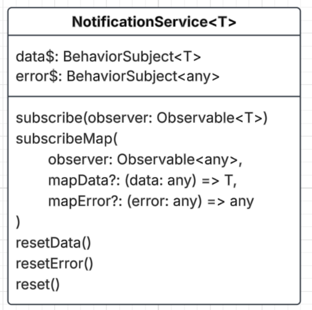

# Subscribe Notify pattern

Appreciate a star on the repository if you find this useful.

## Subscribe Notify pattern

In Angular apps, we need to subscribe to Observables.

eg. if we are making calls to get/post/put/delete data using **HttpClient**.

This pattern encapsulates the subscribe to the Observable into streams.

A data$ stream & an error$ stream.

So, in your component you only deal with streams.

The pattern greatly simplifies dealing with Observables (HttpClient) in your component.

## Notification Service



I have a provided a `NotificationService` that implements this pattern.

```TS
import { Injectable } from '@angular/core';
import { BehaviorSubject, Observable } from 'rxjs';

@Injectable({ providedIn: null })
export class NotificationService<T> {

    public data$: BehaviorSubject<T> = new BehaviorSubject<T>(<T>{});
    public error$: BehaviorSubject<any> = new BehaviorSubject<any>(null);

    public subscribe(observer: Observable<T>) {
        this.resetError();
        observer.subscribe({
            next: (data) => {
                console.log('Data loaded successfully', data);
                this.data$.next(data);
            },
            error: (e) => {
                console.error('Error loading data', e.message);
                this.error$.next(e);
            }
        });
    }

    public subscribeMap(
        observer: Observable<any>,
        mapData?: (data: any) => T,
        mapError?: (error: any) => any
    ) {
        this.resetError();
        observer.subscribe({
            next: (data) => {
                console.log('Data loaded successfully', data);
                if (mapData) {
                    var d = mapData(data);
                    this.data$.next(d);
                    return;
                }
                this.data$.next(data);
            },
            error: (e) => {
                console.error('Error loading data', e.message);
                if (mapError) {
                    e = mapError(e);
                }
                this.error$.next(e);
            }
        });
    }

    public resetData() {
        this.data$.next(<T>{});
    }
    public resetError() {
        this.error$.next(null);
    }
    public reset() {
        this.data$.next(<T>{});
        this.error$.next(null);
    }
}

```

## Usage of NotificationService

In your TypeScript component, you inject the NotificationService,

and set local variables to point to it's data$ & error$ streams.

The mark up uses these variables to render.

Then, when you call it's `subscribe` with your Observable,

data & error get published to the streams.

So, the variables in your component are notified and updated with the latest data or error.

This in turn re-renders the markup.

**component.ts**

```TS
private readonly notificationService = inject(NotificationService<Employee[]>);

private readonly employeeApiService = inject(EmployeeApiService);

public employees$ = this.notificationService.data$;
public error$ = this.notificationService.error$;

getEmployeesByName(searchName: string) {
     // Fetch employees by name.
     // The employeeApiService method returns an Observable<Employee[]>.
     // The employees$ stream will be notified and updated with the data.
     // The error$ stream will be notified and updated with the error if any.
     this.notificationService.subscribe
     (
        this.employeeApiService.getEmployeesByName(searchName)
     );
}
```

**component.html**

```html
@if (error$ | async) {
   <div style="color:red">{{(error$ | async)?.message}}</div>
}

<table>
    <thead>
        <tr>
            <th>Name</th>
            <th>Total Leave Days</th>
        </tr>
    </thead>
    <tbody>
        <!-- Loop through the employees$ stream -->
        @for (employee of employees$ | async; track employee.id) {
            <tr>
                <td>{{ employee.name }}</td>
                <td>{{ employee.totalLeaveDays }}</td>
            </tr>
        }
    </tbody>
</table>
```
